# 🛣️ MAX — Implementation Plan: Drive Mode & Verification Workflow

> **Goal:** Replace the DashcamSimulator with a real **Drive Mode Recording** feature using the phone camera, integrate pothole detection logic from `coding-parrot/pothole-reporter`, and add a **Manual Verification → Contractor Dispatch** workflow.

---

## Architecture Overview

```mermaid
graph LR
    A["📱 Phone Camera\n(WebRTC)"] -->|Frames| B["🌐 Web Frontend\nDrive Mode UI"]
    B -->|POST /api/ml/detect\n(frame + GPS)| C["⚙️ Backend\nNode.js :8000"]
    C -->|Forward image| D["🤖 ML Service\nFastAPI :8001"]
    D -->|Detection Result| C
    C -->|Store report as\n'pending_verification'| E["🗄️ Supabase\nPostgreSQL"]
    E -->|Officer reviews| F["👮 Verification\nDashboard"]
    F -->|Approve →\n'assigned'| G["📧 Contractor\nNotification"]
```

---

## Phase 1: Remove DashcamSimulator & Clean Up

| Task | File | Action |
|------|------|--------|
| 1.1 | [`DashcamSimulator.tsx`](file:///c:/Users/Lenovo/Desktop/MAX/web/src/pages/DashcamSimulator.tsx) | **Delete** this file entirely |
| 1.2 | [`App.tsx`](file:///c:/Users/Lenovo/Desktop/MAX/web/src/App.tsx) | Remove import & route for `/dashcam-simulator` |
| 1.3 | [`AppShell.tsx`](file:///c:/Users/Lenovo/Desktop/MAX/web/src/components/Layout/AppShell.tsx) | Remove sidebar/nav link to "Dashcam Simulator" |
| 1.4 | [`ReportIssue.tsx`](file:///c:/Users/Lenovo/Desktop/MAX/web/src/pages/ReportIssue.tsx) | Remove simulated Drive Mode toggle & GPS drift timer (lines 172-183) |

**Estimate:** ~15 minutes

---

## Phase 2: Build Drive Mode Recording Page

### 2.1 New Page: `DriveMode.tsx`

Replace the old `DashcamSimulator.tsx` with a real camera-based recording page.

**Core Features (inspired by `coding-parrot/pothole-reporter` Drive Mode):**

| Feature | Implementation |
|---------|---------------|
| **Camera Stream** | `navigator.mediaDevices.getUserMedia({ video: { facingMode: 'environment' } })` for rear camera |
| **GPS Tracking** | `navigator.geolocation.watchPosition()` with high accuracy enabled |
| **Frame Sampling** | Every 3-5 seconds, capture a frame from `<video>` element onto `<canvas>`, convert to JPEG blob |
| **Detection Pipeline** | POST each sampled frame + GPS coords to `/api/ml/detect` |
| **Live HUD Overlay** | Show speed (from GPS), detection count, current GPS, elapsed time |
| **Detection Alerts** | When pothole detected (confidence > 0.7), flash alert overlay with bounding box |
| **Session Recording** | Track all detections in session state; show summary on stop |
| **Auto-Report Creation** | Each detection auto-creates a report with status `pending_verification` |

**Detection Contract (from `coding-parrot/pothole-reporter`):**

```typescript
// Detection result schema matching the reference repo
interface DriveDetection {
  image_quality: 'acceptable' | 'rejected';
  assessment: 'damaged' | 'undamaged';
  damage_type: 'pothole_cavity' | 'failed_patch' | 'surface_breakup' | 
               'rut_or_depression' | 'other_road_damage' | null;
  size: 'small' | 'medium' | 'large' | null;
  description: string;
  confidence: number;
  bounding_box: { x1: number; y1: number; x2: number; y2: number };
  gps: { lat: number; lng: number; speed_mps: number; accuracy_m: number };
}
```

**Deduplication Logic (from reference repo):**
- Group detections within 30m radius into one canonical pothole
- Use Haversine formula for distance calculation
- Only create new report if no existing pothole within threshold

### 2.2 UI Design (Dark Glassmorphism Theme)

```
┌─────────────────────────────────────────────┐
│  🛣️ DRIVE MODE                    [⏹ Stop]  │
│ ┌─────────────────────────────────────────┐ │
│ │                                         │ │
│ │         📹 Live Camera Feed             │ │
│ │         (rear-facing, full-width)       │ │
│ │                                         │ │
│ │    ┌─────────────┐                      │ │
│ │    │ 🔴 POTHOLE  │  ← detection overlay │ │
│ │    │  conf: 94%  │                      │ │
│ │    └─────────────┘                      │ │
│ │                                         │ │
│ └─────────────────────────────────────────┘ │
│ ┌─ HUD ──────────────────────────────────┐  │
│ │ 📍 21.1458°N, 79.0882°E  🏎️ 42 km/h   │  │
│ │ ⏱️ 00:12:34   🔍 3 detections found    │  │
│ └────────────────────────────────────────┘  │
│                                             │
│ ┌─ Detection Log ────────────────────────┐  │
│ │ 🔴 12:03:22 — Pothole (94%) — 0.85m²  │  │
│ │ 🟡 12:05:41 — Surface Breakup (87%)   │  │
│ │ 🔴 12:08:15 — Pothole (91%) — 1.2m²   │  │
│ └────────────────────────────────────────┘  │
└─────────────────────────────────────────────┘
```

**Estimate:** ~60 minutes

---

## Phase 3: Backend — Detection Endpoint Refactor

### 3.1 Refactor `/api/ml/detect` route

Current: Accepts dashcam simulation frames  
New: Accept real camera frames with GPS metadata

```typescript
// POST /api/ml/detect
// Body: multipart/form-data
// Fields: image (file), latitude, longitude, speed_mps, accuracy_m, session_id
// Response: { detection: DriveDetection, report_id?: string }
```

### 3.2 Add `pending_verification` status to state machine

Current status flow:
```
submitted → verified → assigned → in_progress → resolved
```

New status flow:
```
pending_verification → verified → assigned → in_progress → resolved
       ↓                                         ↓
    rejected                                  rejected
```

| Task | File | Change |
|------|------|--------|
| 3.1 | [`reports.ts`](file:///c:/Users/Lenovo/Desktop/MAX/backend/src/routes/reports.ts) | Add `pending_verification` to `ALLOWED_TRANSITIONS` |
| 3.2 | [`ml.ts`](file:///c:/Users/Lenovo/Desktop/MAX/backend/src/routes/ml.ts) | Refactor to accept real frames, forward to ML, auto-create reports |
| 3.3 | [`matching.ts`](file:///c:/Users/Lenovo/Desktop/MAX/backend/src/services/matching.ts) | Add Haversine deduplication (30m threshold) |

**Estimate:** ~30 minutes

---

## Phase 4: ML Service — Real Detection Pipeline

### 4.1 Enhance detector.py

Currently uses simulated detection. Enhance to:

1. **Try real YOLO model** first (if `best.pt` weights exist)
2. **Fallback to smart simulation** that analyzes image properties
3. **Match `coding-parrot/pothole-reporter` schema** for damage_type, size, assessment

```python
# New detection result format (matching reference repo)
{
    "image_quality": "acceptable",
    "assessment": "damaged", 
    "damage_type": "pothole_cavity",
    "size": "medium",
    "description": "Open cavity with missing material along left lane edge",
    "confidence": 0.94,
    "bounding_box": {"x1": 220, "y1": 260, "x2": 680, "y2": 560},
    "metrics": {
        "defect_surface_area_sqm": 0.85,
        "estimated_depth_cm": 6.2
    }
}
```

### 4.2 Add frame quality evaluation

From reference repo's `FrameQualityEvaluator.kt`:
- Reject frames with > 80% blur (Laplacian variance check)
- Reject frames too dark (mean brightness < 30)
- Reject frames where sky fills > 40% of frame

**Estimate:** ~25 minutes

---

## Phase 5: Manual Verification Workflow

### 5.1 Officer Verification Dashboard

Enhance [`ReportDetail.tsx`](file:///c:/Users/Lenovo/Desktop/MAX/web/src/pages/ReportDetail.tsx) with:

| Feature | Description |
|---------|-------------|
| **Verification Panel** | Shows AI detection result, image with bounding box, GPS location on map |
| **Approve Button** | `pending_verification` → `verified` → auto-triggers contractor lookup |
| **Reject Button** | `pending_verification` → `rejected` with reason field |
| **Bulk Verify** | In [`Reports.tsx`](file:///c:/Users/Lenovo/Desktop/MAX/web/src/pages/Reports.tsx), add "Pending Verification" tab with batch approve |

### 5.2 Contractor Dispatch (on verification)

When officer clicks **"Verify & Dispatch"**:

1. Status changes: `pending_verification` → `verified` → `assigned`
2. System looks up contractor via GPS → road registry → contractor DB
3. Auto-generates complaint email draft (from reference repo's email pattern)
4. Creates `notification` record for contractor
5. Broadcasts WebSocket event for real-time dashboard update

**Email Draft Template (from reference repo):**
```
Subject: Road Damage Report #{report_id} — {road_name}

Dear {contractor_name},

A road defect has been detected and verified on {road_name} ({contract_number}).

Defect Type: {damage_type}
Severity: {severity}/5
Location: {lat}°N, {lng}°E
Detected: {detected_at}
Estimated Area: {area_sqm} m²

{dlp_notice}

Please address this within the SLA deadline of {sla_due_date}.

Regards,
MAX Civic Issue Tracking System
```

**Estimate:** ~40 minutes

---

## Phase 6: Integration & Polish

| Task | Description | Time |
|------|-------------|------|
| 6.1 | Update [`Landing.tsx`](file:///c:/Users/Lenovo/Desktop/MAX/web/src/pages/Landing.tsx) to showcase Drive Mode feature | 15 min |
| 6.2 | Add "Start Drive" CTA button in sidebar nav | 5 min |
| 6.3 | Add detection session history in Dashboard | 10 min |
| 6.4 | Test full flow: Camera → Detection → Verification → Dispatch | 15 min |
| 6.5 | Clean up reference repo clone (`pothole-reporter-ref/`) | 2 min |

---

## Execution Order & Dependencies

```mermaid
gantt
    title Implementation Timeline
    dateFormat HH:mm
    axisFormat %H:%M

    section Phase 1 - Cleanup
    Remove DashcamSimulator     :p1, 00:00, 15m

    section Phase 2 - Drive Mode
    Build DriveMode.tsx         :p2, after p1, 60m

    section Phase 3 - Backend
    Refactor detection endpoint :p3, after p1, 30m

    section Phase 4 - ML
    Enhance detector.py         :p4, after p3, 25m

    section Phase 5 - Verification
    Officer verification flow   :p5, after p2, 40m

    section Phase 6 - Polish
    Integration & testing       :p6, after p5, 45m
```



---

## Key Design Decisions

| Decision | Rationale |
|----------|-----------|
| **WebRTC for camera** | Works in mobile browsers, no native app needed |
| **Frame sampling every 3-5s** | Matches `coding-parrot/pothole-reporter` Drive Mode sampling interval |
| **30m deduplication radius** | From reference repo's `DuplicateDetector.kt` — prevents duplicate reports |
| **`pending_verification` status** | User requested manual verification before contractor dispatch |
| **No auto-contractor-notify** | Officer must explicitly verify before system contacts contractor |
| **YOLO + simulation fallback** | Real model when weights available, smart simulation otherwise |

---

## Files to Create/Modify

### New Files
- `web/src/pages/DriveMode.tsx` — Main Drive Mode recording page
- `web/src/hooks/useCamera.ts` — Camera stream hook
- `web/src/hooks/useGeoLocation.ts` — GPS tracking hook  
- `web/src/hooks/useDriveSession.ts` — Drive session state management

### Modified Files
- `web/src/App.tsx` — Update routes
- `web/src/components/Layout/AppShell.tsx` — Update nav
- `web/src/pages/ReportIssue.tsx` — Remove drive simulation, add Drive Mode link
- `web/src/pages/ReportDetail.tsx` — Add verification panel
- `web/src/pages/Reports.tsx` — Add pending verification tab
- `backend/src/routes/ml.ts` — Real frame detection endpoint
- `backend/src/routes/reports.ts` — Add `pending_verification` status
- `backend/src/services/matching.ts` — Add deduplication
- `ml/inference/detector.py` — Enhanced detection

### Deleted Files
- `web/src/pages/DashcamSimulator.tsx`

---

> [!IMPORTANT]
> **Ready to proceed?** Click "Proceed" to start execution from Phase 1.
> Estimated total time: ~3.5 hours of implementation.
